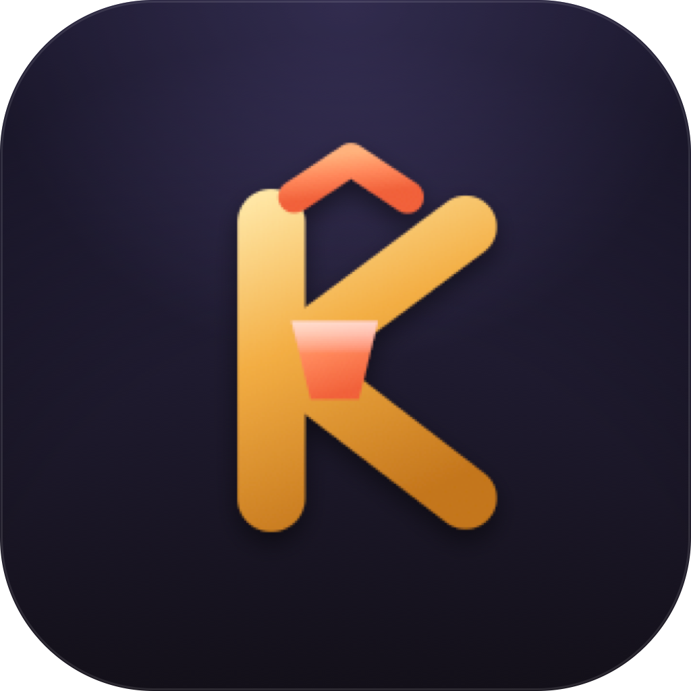

<div align="center">



# Keystone

**Bộ gõ tiếng Việt hiện đại cho macOS**

Viết mới hoàn toàn bằng Swift/SwiftUI — tập trung vào **độ ổn định** và **giao diện đẹp**,
diệt tận gốc lỗi kinh điển *"đang gõ tự nhiên mất tiếng Việt"* của các bộ gõ đời cũ.

<br/>


[](https://github.com/tanhattan0051/Kevstone/actions/workflows/ci.yml)

[Vì sao Keystone](#vì-sao-keystone) ·
[Tính năng](#tính-năng) ·
[Cài đặt](#cài-đặt) ·
[Cấp quyền](#cấp-quyền-hệ-thống) ·
[Kiến trúc](#kiến-trúc) ·
[Lộ trình](#trạng-thái--lộ-trình)

</div>

---

## Vì sao Keystone?

Các bộ gõ tiếng Việt cũ trên macOS hay gặp một lỗi khó chịu: **đang gõ ngon lành thì đột nhiên
mất tiếng Việt**, phải bật/tắt lại mới gõ tiếp được. Nguyên nhân gốc là hệ thống tự tắt event tap
(khi timeout / khi người dùng nhập dồn) mà bộ gõ không bật lại, cộng thêm việc xử lý nặng ngay trên
đường phím nóng (hot path).

Keystone giải quyết bằng **hai lớp phòng thủ** cho vòng đời event tap:

- **Lớp A — tự phục hồi tức thì:** khi macOS gửi `tapDisabledByTimeout` / `tapDisabledByUserInput`,
  Keystone bật lại tap **ngay trong callback**.
- **Lớp B — watchdog dự phòng:** một timer riêng cứ **1.5s** kiểm tra và bật lại tap nếu nó chết —
  đảm bảo tap *không bao giờ* nằm chết.

Cùng với **self-tag** chống xử lý lại chính event mình sinh ra, **không làm việc nặng trên hot path**
(tap chạy trên thread + run loop riêng, tách khỏi UI), và truy cập engine an toàn đa luồng qua
`OSAllocatedUnfairLock`. Đây là những gì làm nên khác biệt của Keystone so với bộ gõ cũ.

> **Clean-room, bản quyền của bạn.** Engine tiếng Việt được **viết mới từ đầu**, không đọc/chép mã
> nguồn của bất kỳ bộ gõ nào — nhờ vậy Keystone thuộc bản quyền tác giả và phát hành theo giấy phép
> **MIT** thoải mái.

---

## Tính năng

### Kiểu gõ & bảng mã

| Kiểu gõ | Trạng thái |
|---|---|
| **Telex** (mặc định) | ✅ Đầy đủ |
| **VNI** | ✅ Đầy đủ |
| Simple Telex 1 / 2 | 🚧 Đang tạm chạy như Telex (xem [lộ trình](#trạng-thái--lộ-trình)) |

- **Quick Telex** *(tuỳ chọn, mặc định tắt):* gõ đúp phụ âm để nở nhanh — `cc→ch`, `gg→gi`,
  `kk→kh`, `nn→ng`, `pp→ph`, `qq→qu`, `tt→th`. Riêng `dd→đ` luôn bật.
- **5 bảng mã đầu ra:** Unicode dựng sẵn *(mặc định)*, Unicode tổ hợp, TCVN3, VNI-Windows, CP1258.
- **Công cụ chuyển mã** văn bản có sẵn (Unicode dựng sẵn ↔ tổ hợp, CP1258 hai chiều; TCVN3 /
  VNI-Windows đang hoàn thiện chiều chuyển ngược).

### Đặt dấu & xử lý thông minh

- **Đặt dấu kiểu mới / cũ** cho các cặp nguyên âm mở `oa`, `oe`, `uy`:
  - Kiểu mới *(mặc định):* `hòa` · `khỏe` · `thủy`
  - Kiểu cũ *(tuỳ chọn):* `hoà` · `khoẻ` · `thuỷ`
- **Khôi phục khi gõ sai** *(mặc định bật):* âm tiết không hợp lệ theo âm vị học sẽ tự trả về đúng
  chuỗi phím thô — nhờ đó gõ từ tiếng Anh như `coins`, `ruins`, `rains` không bị "Việt hoá" nhầm.
- **Khôi phục dấu qua Backspace:** buffer được dựng lại từ phím thô sau mỗi lần gõ (kể cả xoá), nên
  xoá một ký tự dấu rồi gõ lại luôn đúng. Có cả **double-strike undo** (gõ lại phím thanh lần hai để
  bỏ dấu và trả ra ký tự thô).
- **Bỏ dấu tự do** *(mặc định bật):* đặt dấu không cần liền kề chữ — ví dụ `roiof → rồi`.
- **Bỏ dấu cuối từ** *(mặc định bật):* cho dấu vượt qua cả phụ âm cuối — `trene → trên`,
  `dadng → đang`. Đánh đổi có chủ đích: vài từ tiếng Anh (`mama`, `dad`) có thể bị hiểu thành tiếng
  Việt (có cảnh báo trong Bảng điều khiển).
- **Tự viết hoa đầu câu** *(mặc định tắt).*

### Gõ tắt & macro

- **Gõ tắt phụ âm** *(mặc định tắt):* đầu từ `f→ph`, `j→gi`, `w→qu`; sau nguyên âm `g→ng`, `h→nh`,
  `k→ch`.
- **Macro (gõ tắt cụm từ)** *(mặc định tắt):* khớp chính xác, **phân biệt hoa/thường**, nổ đúng lúc
  chốt từ — thắng cả xử lý tiếng Việt lẫn cơ chế khôi phục. Có thể **nhập trực tiếp file macro `.txt`
  của OpenKey** và xuất ra JSON riêng.

### Chuyển chế độ theo ứng dụng

- **Smart-switch** *(mặc định bật):* nhớ & khôi phục trạng thái Việt/Anh **theo từng ứng dụng**.
- **Nhớ bảng mã theo ứng dụng** *(mặc định bật).*
- Nút **"Xoá ghi nhớ theo ứng dụng"** để đặt lại phần đã học.

### Phím tắt & tiện ích hệ thống

- **Phím chuyển Việt/Anh:** `⌃⇧` *(mặc định)*, hoặc `⌥⇧` · `⌘⇧` · `⌃⌥` · Tắt. Nhận diện bằng máy
  trạng thái riêng (ngoài hot path), có phím khác chen vào là huỷ để tránh trùng shortcut.
- **Chỉ báo V/E** ngay trên menu bar.
- **Khởi động cùng macOS** *(mặc định tắt, `SMAppService`)*, **hiện icon trên Dock** *(mặc định
  tắt)*, **mở Bảng điều khiển khi khởi động** *(mặc định tắt)*.
- **Sửa lỗi gợi ý** & **Gửi từng phím** *(mặc định tắt):* né lỗi nhân đôi ký tự ở một số trình duyệt
  / bảng tính.
- **Khoá một phiên bản** (single-instance) tránh chạy trùng gây gõ đôi.

### Bảng điều khiển

Bốn tab: **Cơ bản** (kiểu gõ, bảng mã, tuỳ chọn gõ, quyền) · **Gõ tắt** · **Hệ thống** (khởi động,
cập nhật, hiển thị) · **Thông tin**. Kèm cửa sổ **Công cụ chuyển mã**, trình **soạn gõ tắt**, và
**Onboarding** hướng dẫn cấp quyền.

---

## Cài đặt

### Build từ mã nguồn *(hiện tại)*

Yêu cầu Swift 6 toolchain (Xcode 16+). Bản dựng từ mã nguồn hiện tại chạy từ **macOS 14 trở lên**.

```bash
git clone https://github.com/tanhattan0051/Kevstone.git
cd Kevstone
swift build && swift test     # engine + tầng nhập phải luôn xanh
swift run Keystone            # chạy app menu-bar, cấp quyền Accessibility khi được hỏi
```

> 🎯 **Mục tiêu bản phát hành (Phase 5):** app đóng gói sẽ nhắm **macOS 26/27** với giao diện Liquid
> Glass. Hiện tại UI dùng vật liệu SwiftUI chuẩn và deployment target là macOS 14.

> ⚠️ Gõ tiếng Việt ở mọi ứng dụng **chỉ hoạt động trên macOS thật đã cấp quyền Accessibility**.
> Sau `swift run Keystone`, cấp quyền rồi thử gõ ở TextEdit / Notes / Safari.

### Đóng gói `.app` / DMG *(cần tài khoản Apple Developer)*

Bộ script trong [`Scripts/`](Scripts/) dựng app, ký Developer ID, đóng DMG và notarize:

```bash
Scripts/build_app.sh                          # dựng Keystone.app (mặc định ./dist)
Scripts/sign.sh      dist/Keystone.app        # cần APPLE_DEV_ID_NAME + APPLE_TEAM_ID
Scripts/make_dmg.sh  dist/Keystone.app dist/Keystone.dmg
Scripts/notarize.sh  dist/Keystone.dmg        # cần profile keychain KEYSTONE_NOTARY
```

Pipeline này cũng chạy tự động qua GitHub Actions khi push tag `v*` (nếu đã cấu hình đủ secret
Apple). Bản DMG ký + notarize chính thức sẽ có ở mục **Releases** khi tài khoản Apple sẵn sàng.

---

## Cấp quyền hệ thống

| Quyền | Bắt buộc? | Vì sao |
|---|---|---|
| **Accessibility** | ✅ Bắt buộc | Tạo event tap để chuyển đổi phím ở mọi ứng dụng. Không có → bộ gõ không chạy. |
| **Input Monitoring** | Khuyến nghị | Quan sát phím toàn hệ thống ổn định hơn, tránh rơi phím. |

Cửa sổ **Onboarding** tự mở lần đầu để hướng dẫn cấp quyền; nút "Bắt đầu gõ" / "Để sau" không bao
giờ bị khoá. Nếu cấp quyền xong mà tap chưa tạo được, menu bar sẽ hiện nút **"Khởi động lại
Keystone"**.

---

## Kiến trúc

```
KeystoneEngine  (Swift thuần — logic thuần, phủ test cao)
                Syllable · Telex/VNI · đặt dấu · âm vị học · 5 bảng mã · macro · diff
KeystoneInput   (macOS)  CGEventTap 2 lớp + watchdog + self-tag · executor · smart-switch
Keystone (app)  (SwiftUI) MenuBarExtra · Bảng điều khiển 4 tab · chuyển mã · gõ tắt · onboarding
```

Ba module tách bạch trong một [Swift Package](Package.swift): `KeystoneEngine` không phụ thuộc AppKit
(chạy & test được ở mọi nơi), `KeystoneInput` bọc phần macOS, còn app SwiftUI ghép cả hai. Logic
nghiệp vụ tiếng Việt nằm hết ở tầng engine dưới dạng **hàm thuần** — dễ test, dễ đọc, dễ sửa.

---

## Kiểm thử & CI

- **Engine:** 108 hàm test chạy trên **251 ca corpus tiếng Việt** (11 file JSON: thanh, dấu, đặt dấu,
  vị trí, quick-telex, VNI, regression, khôi phục…).
- **Tầng nhập:** 46 hàm test (translator, executor, engine-controller, phím chuyển, smart-switch).
- **Tổng: 154 hàm test**, tất cả xanh.
- **CI:** [`ci.yml`](.github/workflows/ci.yml) chạy `swift build && swift test` (toàn bộ suite) trên
  `macos-15` cho mỗi push & pull request.

---

## Trạng thái & lộ trình

| Giai đoạn | Tình trạng |
|---|---|
| **1 — Engine + corpus test** | ✅ Xong |
| **2 — Tầng nhập + menu bar** | ✅ Xong *(cần nghiệm thu máy thật)* |
| **3 — Kiểu gõ & bảng mã** (VNI, Quick Telex, 5 bảng mã) | ✅ Xong |
| **4 — Tính năng & UI** (macro, smart-switch, phím chuyển, onboarding, toggle hệ thống) | ✅ Xong *(cần nghiệm thu máy thật)* |
| **5 — macOS 26/27 (Liquid Glass) · ký / notarize / DMG / auto-update** | 🚧 Có script, chờ tài khoản Apple |

**Còn nợ (không chặn):** tách logic riêng cho Simple Telex 1/2 (hiện map về Telex) · chiều chuyển mã
ngược cho TCVN3 / VNI-Windows · bộ kiểm tra bản mới thật (Sparkle) · `spellCheck` (chờ chốt ngữ nghĩa
để không trùng `restoreIfInvalid`).

---

## Tài liệu

- 📄 **Thiết kế đầy đủ:** [`docs/superpowers/specs/2026-09-16-keystone-design.md`](docs/superpowers/specs/2026-09-16-keystone-design.md)
- 🧭 **Bắt đầu từ đâu:** [`HANDOFF.md`](HANDOFF.md)
- 🧩 **Các quyết định kỹ thuật:** [`DECISIONS.md`](DECISIONS.md)
- 🎨 **Icon & tài sản thiết kế:** [`Design/`](Design/)

---

## Đóng góp

Rất hoan nghênh issue và pull request. Vài quy ước:

- `swift test` phải **luôn xanh** — logic engine đi kèm test (ưu tiên viết test trước).
- Logic nghiệp vụ (parse/đặt dấu/chính tả) đặt ở tầng `KeystoneEngine` dưới dạng hàm thuần, không nhét
  vào tầng nhập / UI.
- Tính năng mới nên **ship dormant** (mặc định tắt) rồi bật khi cấu hình đủ.

---

## Giấy phép

Phát hành theo giấy phép **MIT** — xem [`LICENSE`](LICENSE).
Bản quyền © 2026 **Tạ Nhật Tân**.

## Tác giả

**Tạ Nhật Tân** — mọi góp ý xin gửi về **tanhattan0051@gmail.com**.

## Lời cảm ơn

Cảm ơn [**OpenKey**](https://github.com/tuyenvm/OpenKey) của Tuyen Mai — nguồn cảm hứng và là tham
chiếu quý giá về những lỗi thực tế mà một bộ gõ tiếng Việt cần tránh. Keystone được viết
**clean-room** (không sử dụng mã nguồn của OpenKey) nhằm tạo một sản phẩm độc lập với giấy phép riêng.
